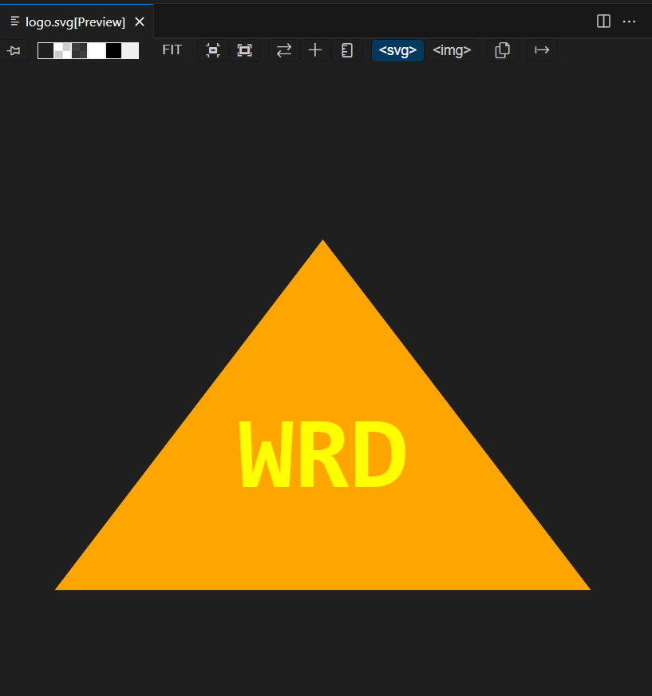
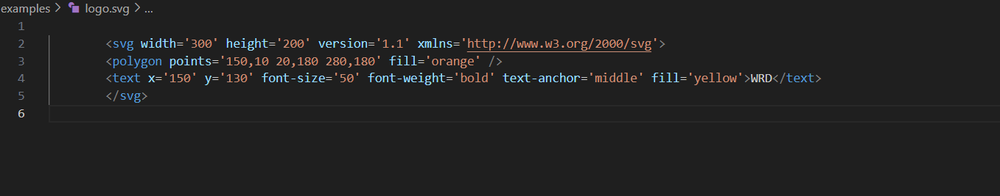

# SVG Logo Maker

## Description

This project was to create a SVG Logo Maker for a freelance web developer so they could generate simple logos for their projects for free. When the user runs the Logo Maker, the user would be prompted to provide text (up to three characters), text colour, shape and shape colour to generate their logo. Which will generate a svg file containing the user's input.

## Installation
If you have copied over the repository you may need to install Node.js + Dependencies
To install dependencies, in the integrated terminal run:
npm install
Ensure the correct versions of inquirer and jest are installed.

npm install inquirer@8.2.4

npm install jest@29.7.0

## Usage
To use the application, open the intergrated terminal and ensure all installations are complete. Once all installations are complete, type in:

node index.js

You will then be prompted to provide input to create the SVG Logo.
Be careful to ensure the text is no longer than 3 characters long and no input are left blank. 
Once the text, text colour, shape and shape colour are provided. The Logo will be generated in the examples folder.

You may also want to run the tests for the application, check the Tests section below for more info.

## Credits
- Many internet resources
- Class/Teacher's resources
- Tom's help with validate
- Mozilla SVG tutorial: https://developer.mozilla.org/en-US/docs/Web/SVG/Tutorial/Basic_Shapes
- SVG VS code extension: https://marketplace.visualstudio.com/items?itemName=jock.svg

## Tests
This project has tests in ./lib/shapes.tests.js

It conducts 3 tests to ensure the logos are generating the correct content.
- Testing for Triangle shape with blue shape colour
- Testing for Circle shape with red text colour
- Testing for Square shape containing 'NEW' text

To run this test type in the console

npm test

## License
N/A / ISC license in package.json

## GitHub Repository

[GitHub Repository](https://github.com/HarryP-GitHub/SVG-Logo-Maker)

## Video Demo

[Video Demo](https://drive.google.com/file/d/1vVne4sv8X5VWkXUhLl6O_nuFeXqOqzmU/view?usp=sharing)

This is how the SVG Logo will look in preview

